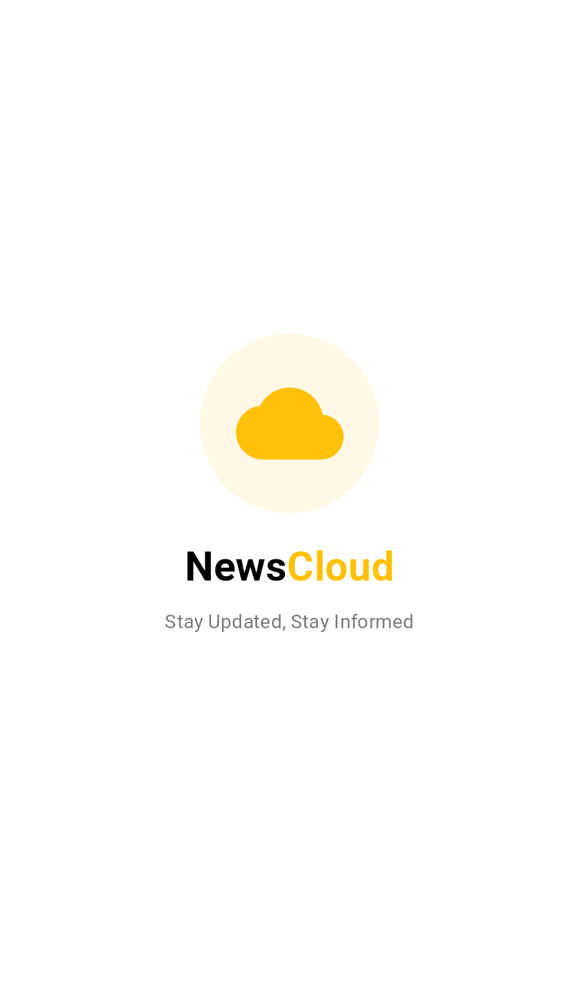

# 📰 NewsCloud - Flutter News Application

[](https://flutter.dev)
[](https://dart.dev)
[](https://flutter.dev)
[](LICENSE)
[](https://github.com/Zeyad-GenAI/Furniture_App)
[](https://github.com/Zeyad-GenAI/Furniture_App/releases)

<div align="center">
  <h3>🌟 Stay Updated, Stay Informed 🌟</h3>
  <p>A modern, elegant Flutter news application that delivers the latest news from around the world with a beautiful user interface and smooth animations.</p>
</div>

---

## ✨ Key Features

- 🚀 **Smooth Animations** - Beautiful splash screen with fade and scale transitions
- 📱 **Responsive Design** - Optimized for all screen sizes and orientations
- 🔄 **Pull-to-Refresh** - Effortless content updates with swipe gestures
- 🎨 **Modern UI/UX** - Clean, intuitive interface with amber accent colors
- 📂 **Category Navigation** - Browse news by different categories
- 🌐 **WebView Integration** - Read full articles within the app
- ⚡ **Fast Performance** - Optimized scrolling with CustomScrollView and Slivers
- 🔍 **Search Functionality** - Find specific news articles quickly
- 📌 **Bottom Navigation** - Easy access to Home, Saved, Explore and Settings
- 🎯 **State Management** - Efficient state handling with StatefulWidget

---

## 📱 App Screenshots

<div align="center">
  <table>
    <tr>
      <td align="center">
        
        <br />
        <sub><b>Splash Screen</b></sub>
      </td>
      <td align="center">
        
        <br />
        <sub><b>Home Screen</b></sub>
      </td>
      <td align="center">
        
        <br />
        <sub><b>Article WebView</b></sub>
      </td>
    </tr>
  </table>
</div>

---

## 🛠️ Tech Stack & Dependencies

### **Core Technologies**
- **Flutter SDK** `^3.0.0` - [Documentation](https://docs.flutter.dev/)
- **Dart** `^3.0.0` - [Documentation](https://dart.dev/guides)

### **Key Packages**
```yaml
dependencies:
  flutter:
    sdk: flutter
  webview_flutter: ^4.0.0      # WebView integration
  http: ^1.1.0                 # API calls
  cached_network_image: ^3.3.0 # Image caching & optimization
  pull_to_refresh: ^2.0.0      # Pull-to-refresh functionality
  flutter_spinkit: ^5.2.0      # Loading animations
  url_launcher: ^6.1.14        # External URL handling
  shared_preferences: ^2.2.1   # Local data storage
  intl: ^0.18.1               # Date formatting & internationalization
```

### **Development Tools**
- 🔧 **VS Code** / **Android Studio** - IDE
- 🧪 **Flutter Test** - Unit and widget testing
- 📊 **Flutter Inspector** - UI debugging
- 🎨 **Material Design 3** - Design system

---

## 🚀 Getting Started

### Prerequisites
- Flutter SDK (3.0.0 or higher)
- Dart SDK (3.0.0 or higher)
- Android Studio / VS Code
- Android SDK / Xcode (for iOS)

### Installation Steps

1. **Clone the repository**
   ```bash
   git clone https://github.com/Zeyad-GenAI/News_Application.git
   cd News_Application
   ```

2. **Install dependencies**
   ```bash
   flutter pub get
   ```

3. **Configure API Keys** *(if using news APIs)*
   ```bash
   # Create a .env file in the root directory
   echo "NEWS_API_KEY=your_api_key_here" > .env
   ```

4. **Run the application**
   ```bash
   # For development
   flutter run
   
   # For release build
   flutter build apk --release
   flutter build ios --release
   ```

### 📋 Additional Setup

- **Android**: Ensure minimum SDK version 23 in `android/app/build.gradle`
- **iOS**: Set minimum deployment target to iOS 11.0 in `ios/Runner.xcodeproj`
- **Web**: Enable web support with `flutter config --enable-web`

---

## 📁 Project Structure
```
lib/
├── Model/
│   ├── article_model.dart
│   └── category_model.dart
├── Screens/
│   ├── home_screen.dart
│   ├── splash_screen.dart
│   └── web_view_screen.dart
├── services/
│   └── news_services.dart
├── Widgets/
│   ├── category_card.dart
│   ├── category_list_view.dart
│   ├── news_card.dart
│   └── news_list_view.dart
└── main.dart
```

---

## 🎨 UI/UX Features

### **Design Highlights**
- 🎯 **Consistent Branding** - NewsCloud identity with amber accent
- 🌊 **Smooth Animations** - Custom fade and scale transitions
- 📱 **Responsive Layout** - Adaptive design for all devices
- 🔄 **Interactive Elements** - Pull-to-refresh, tap animations
- 🎨 **Material Design 3** - Modern design language

### **Performance Optimizations**
- ⚡ **Sliver Widgets** - Efficient scrolling performance
- 🖼️ **Image Caching** - Reduced network requests
- 🧠 **State Management** - Optimized widget rebuilds
- 📦 **Lazy Loading** - On-demand content loading

---

## 🧪 Testing

```bash
# Run all tests
flutter test

# Run tests with coverage
flutter test --coverage

# Run integration tests
flutter drive --target=test_driver/app.dart
```

---

## 🤝 Contributing

We welcome contributions! Here's how you can help:

1. **Fork the repository**
2. **Create your feature branch**
   ```bash
   git checkout -b feature/amazing-feature
   ```
3. **Commit your changes**
   ```bash
   git commit -m 'Add some amazing feature'
   ```
4. **Push to the branch**
   ```bash
   git push origin feature/amazing-feature
   ```
5. **Open a Pull Request**

### 📋 Contribution Guidelines
- Follow Flutter/Dart coding standards
- Write tests for new features
- Update documentation as needed
- Use meaningful commit messages

---

## 🐛 Issues & Support

- 🔗 **Report Bugs**: [GitHub Issues](https://github.com/Zeyad-GenAI/News_Application/issues)
- 💬 **Discussions**: [GitHub Discussions](https://github.com/Zeyad-GenAI/News_Application/discussions)
- 📧 **Email Support**: zeyadelfaramawy@gmail.com

---

## 🎯 Roadmap

- [ ] 🔐 User authentication and profiles
- [ ] 💾 Offline reading capability
- [ ] 🔔 Push notifications
- [ ] 🌙 Dark mode support
- [ ] 🌍 Multi-language support
- [ ] 📊 Reading analytics
- [ ] 🔖 Advanced bookmarking system
- [ ] 🎨 Customizable themes

---

## 📄 License

This project is licensed under the **MIT License** - see the [LICENSE](LICENSE) file for details.

```
MIT License

Copyright (c) 2024 NewsCloud Team

Permission is hereby granted, free of charge, to any person obtaining a copy
of this software and associated documentation files (the "Software"), to deal
in the Software without restriction, including without limitation the rights
to use, copy, modify, merge, publish, distribute, sublicense, and/or sell
copies of the Software, and to permit persons to whom the Software is
furnished to do so, subject to the following conditions:

The above copyright notice and this permission notice shall be included in all
copies or substantial portions of the Software.
```

---

## 🙏 Acknowledgments

- 🎨 **Material Design Team** - For the beautiful design system
- 📱 **Flutter Team** - For the amazing framework
- 🌐 **News API Providers** - For reliable news data
- 👥 **Open Source Community** - For inspiration and support
- ☕ **Coffee** - For keeping us caffeinated during development

---

<div align="center">
  <h3>⭐ If you like this project, please give it a star! ⭐</h3>
  <p>Made with ❤️ by the NewsCloud Team</p>
</div>

---

<div align="center">
  <sub>Built with Flutter 💙 | Powered by News APIs 🌐 | Designed for Everyone 📱</sub>
</div>

<p align="center">
  <a href="#top">⬆️ Back to Top</a>
</p>
